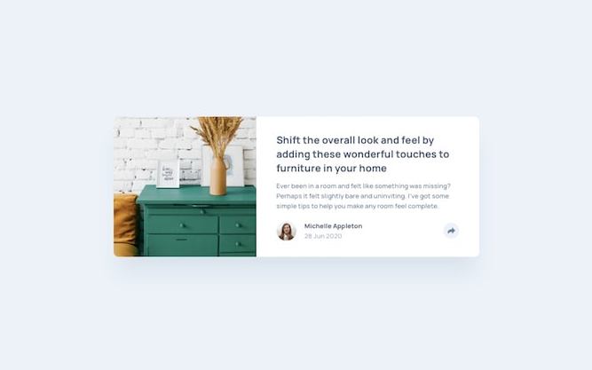

# Frontend Mentor - Article preview component solution

This is a solution to the [Article preview component challenge on Frontend Mentor](https://www.frontendmentor.io/challenges/article-preview-component-dYBN_pYFT). Frontend Mentor challenges help you improve your coding skills by building realistic projects.

## Table of contents

- [Overview](#overview)
  - [The challenge](#the-challenge)
  - [Screenshot](#screenshot)
  - [Links](#links)
- [My process](#my-process)
  - [Built with](#built-with)
  - [What I learned](#what-i-learned)
  - [Continued development](#continued-development)
- [Author](#author)

## Overview

### The challenge

Users should be able to:

- View the optimal layout for the component depending on their device's screen size
- See the social media share links when they click the share icon

### Screenshot

### Links

- Solution: [Frontend Mentor Solution](https://www.frontendmentor.io/solutions/responsive-article-preview-component-w-nextjsreacttailwind-W6Uf9b0QwQ)
- Live Site: [Article Preview Card Deploy on Vercel](https://learning-tailwind-inky.vercel.app/website-projects/article-preview-card)

## My process

### Built with

- Semantic HTML5 markup
- CSS custom properties
- Flexbox
- [React](https://reactjs.org/) - JS library
- [Next.js](https://nextjs.org/) - React framework
- [tailwindcss](https://tailwindcss.com/) - A utility-first CSS framework

### What I learned

The one challenge that I ran into with this component involved several factors.

The first was the fact that the background image needed to be cropped by the parent container so that the corners of the image were also rounded like the parent container. This was originally achieved by using the `overflow-hidden` tailwind directive. I originally placed this on the top level card container.

The second piece was that the toast component that shows up when the user clicks the share button contained overflow. The toast element was wider than the card container in both desktop and tablet layouts. This meant that the `overflow-hidden` class was causing the overflow to be hidden.

The solution ended up being pretty simple in the end, despite Grok/ChatGPT suggesting incredibly complex solutions to the problem. I simply moved the `overflow-hidden` class to the `
` that contained the background image. This still rounded the edges of the image as intended. However, since this `
` was not a parent of the toast, it no longer caused it to have it's overflow hidden.

So what did I learn then? I learned that LLMs can be useful for getting you unstuck sometimes, although when I stop to think about problems rather than relying on something that can do it "fast", I come up with more elegant solutions than my "pair programmer" 80-90% of the time.

### Continued development

Really the only thing that I want to change about this current component is that the background image is done purely in tailwind CSS, and is not being passed to the `ArticlePreviewCard` component as a prop. I'd like to fix this since I'm assuming that background would be different for each article.

## Author

- GitHub - [ecarlste](https://github.com/ecarlste)
- Frontend Mentor - [@ecarlste](https://www.frontendmentor.io/profile/ecarlste)
- LinkedIn - [Erik Carlsten](https://www.linkedin.com/in/erikcarlsten)
