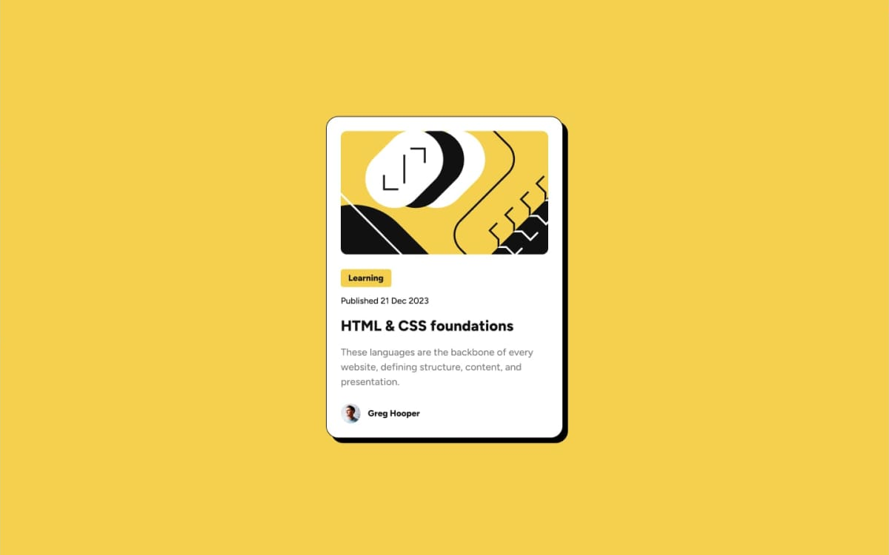

# Frontend Mentor - Blog preview card solution

This is a solution to the [Blog preview card challenge on Frontend Mentor](https://www.frontendmentor.io/challenges/blog-preview-card-ckPaj01IcS). Frontend Mentor challenges help you improve your coding skills by building realistic projects.

## Table of contents

- [Overview](#overview)
  - [The challenge](#the-challenge)
  - [Screenshot](#screenshot)
  - [Links](#links)
- [My process](#my-process)
  - [Built with](#built-with)
  - [What I learned](#what-i-learned)
  - [Continued development](#continued-development)
- [Author](#author)

## Overview

### The challenge

Users should be able to:

- See hover and focus states for all interactive elements on the page

### Screenshot

### Links

- Solution: [Frontend Mentor Solutions](https://www.frontendmentor.io/profile/ecarlste/solutions)
- Live Site: [QR Code Deployed on Vercel](https://learning-tailwind-inky.vercel.app/website-projects/blog-preview-card)

## My process

### Built with

- Semantic HTML5 markup
- CSS custom properties
- Flexbox
- [React](https://reactjs.org/) - JS library
- [Next.js](https://nextjs.org/) - React framework
- [tailwindcss](https://tailwindcss.com/) - A utility-first CSS framework

### What I learned

I learned how to create a custom `box-shadow` in tailwindcss in order to make it solid since that isn't something that tailwind provides out of the box. I also used the same technique to create the `--color-yellow` in the tailwind `@theme` so I could use it in both `bg-yellow` and `hover:text-yellow`.

I had also never imported a Google font in NextJS before using multiple weights and I did not realize that it could take either a single value or an array of weight values when importing the font. This allowed me to simply use one variable for the font and to use the `font-bold` tailwind utility to set it to the right font weight.

### Continued development

I think the biggest thing that I felt like I was missing here was some UI tests using something like Playwright or Cypress. I've never used either of these frameworks and they are the two recommended in the NextJS documentation for E2E and component testing, so I'd like to play with them a bit.

## Author

- GitHub - [ecarlste](https://github.com/ecarlste)
- Frontend Mentor - [@ecarlste](https://www.frontendmentor.io/profile/ecarlste)
- LinkedIn - [Erik Carlsten](https://www.linkedin.com/in/erikcarlsten)
