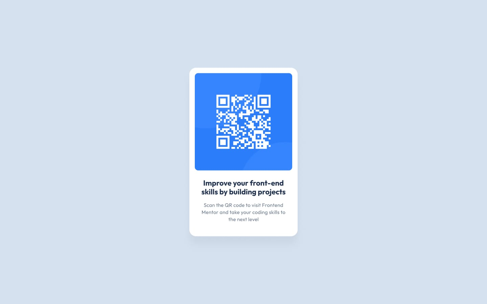

# Frontend Mentor - QR code component solution

This is a solution to the [QR code component challenge on Frontend Mentor](https://www.frontendmentor.io/challenges/qr-code-component-iux_sIO_H). Frontend Mentor challenges help you improve your coding skills by building realistic projects.

## Table of contents

- [Overview](#overview)
  - [Screenshot](#screenshot)
  - [Links](#links)
- [My process](#my-process)
  - [Built with](#built-with)
  - [What I learned](#what-i-learned)
  - [Continued development](#continued-development)
- [Author](#author)

## Overview

### Screenshot



### Links

- Solution URL: https://www.frontendmentor.io/profile/ecarlste/solutions
- Live Site URL: https://learning-tailwind-inky.vercel.app/website-projects/qr-code

## My process

### Built with

- [React](https://reactjs.org/) - JS library
- [Next.js](https://nextjs.org/) - React framework
- [tailwindcss](https://tailwindcss.com/) - A utility-first CSS framework

### What I learned

This was the first time that I have used a `line-height` utility in tailwind. I have used it previously with CSS in the past very rarely so I knew it existed, although I wasn't sure how to do it in tailwind.

It turns out to be quite simple. Let's take the following example paragraph with a custom text size and see how we can add a line height to that using tailwind.

```html
<p className="text-lg">Set large text with no line height specified.</p>
```

Now if we want to set the line height and font size at the same time we would specific it as follows:

```html
<p className="text-lg/6">Set large text with a line height 6.</p>
```

You can also use other stand alone properties like `leading-none` or `leading-<number>` to set the line height without setting the text size. You can check out all of the available settings for `line-height` in tailwind in [their docs](https://tailwindcss.com/docs/line-height).

### Continued development

I'm still not feeling super confident at this point with how to position text within a container like a div or paragraph. In this solution I used `px-3` on the `div` containing all three sections of text to squish it in a bit. I'd like to play around with this a bit more and see if there are better ways to do this.

I also didn't extract the `qr-code` out into it's own react component that's passed props to solve this challenge. I'll likely create a follow up PR to do exactly that just in case I ever want to use it for something.

It would be fun to take the QR Code image and break it up into the background and also the QR Code itself, since you would likely be passing a QR code into the component as a prop and rendering it on top of the blue background.

## Author

- GitHub - [ecarlste](https://github.com/ecarlste)
- Frontend Mentor - [@ecarlste](https://www.frontendmentor.io/profile/ecarlste)
- LinkedIn - [Erik Carlsten](https://www.linkedin.com/in/erikcarlsten)
