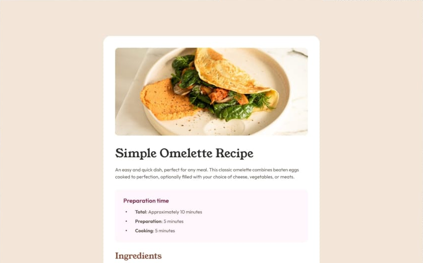

# Frontend Mentor - Recipe page solution

This is a solution to the [Recipe page challenge on Frontend Mentor](https://www.frontendmentor.io/challenges/recipe-page-KiTsR8QQKm). Frontend Mentor challenges help you improve your coding skills by building realistic projects.

## Table of contents

- [Overview](#overview)
  - [The challenge](#the-challenge)
  - [Screenshot](#screenshot)
  - [Links](#links)
- [My process](#my-process)
  - [Built with](#built-with)
  - [What I learned](#what-i-learned)
  - [Continued development](#continued-development)
- [Author](#author)

## Overview

### Screenshot

### Links

- Solution: [Frontend Mentor Solutions](https://www.frontendmentor.io/profile/ecarlste/solutions)
- Live Site: [Recipe Page Deployed on Vercel](https://learning-tailwind-inky.vercel.app/website-projects/recipe-page)

## My process

### Built with

- Semantic HTML5 markup
- Flexbox
- Mobile-first workflow
- [React](https://reactjs.org/) - JS library
- [Next.js](https://nextjs.org/) - React framework
- [tailwindcss](https://tailwindcss.com/) - A utility-first CSS framework

### What I learned

I ran into an issue where my responsive design was showing correctly for mobile and then when scaling up for larger screens it would rescale up fine, but when I resized back down it would not hit breakpoints correctly.

I eventually realized that it was because I did not have a default set, because some settings were not needed when I was only testing for mobile at 375px. An example of this is when using `sm:rounded-3xl` for screens larger than a phone. If I started on the page looking at it in mobile design, the corners were not rounded, but when I scaled up and then back down the corners would remain longer than I expected.

Once set set the style to `rounded-none sm:rounded-3xl` it responded correctly for both mobile as well as larger screens and the breakpoint was hit correctly when scaling up and down.

### Continued development

One thing that I didn't do during this challenge was create a recipe data type to hold all of the data for the recipe page itself. I used data types for some smaller components within the `RecipePage`, although on a site where you were loading recipes from the database, you'd certainly have one larger data structure holding all of the data for the recipe.

If I ever use this component then I'll circle back and do this!

## Author

- GitHub - [ecarlste](https://github.com/ecarlste)
- Frontend Mentor - [@ecarlste](https://www.frontendmentor.io/profile/ecarlste)
- LinkedIn - [Erik Carlsten](https://www.linkedin.com/in/erikcarlsten)
