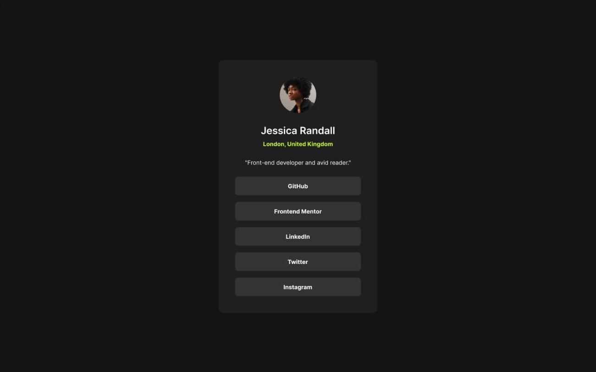

# Frontend Mentor - Social links profile solution

This is a solution to the [Social links profile challenge on Frontend Mentor](https://www.frontendmentor.io/challenges/social-links-profile-UG32l9m6dQ). Frontend Mentor challenges help you improve your coding skills by building realistic projects.

## Table of contents

- [Overview](#overview)
  - [The challenge](#the-challenge)
  - [Screenshot](#screenshot)
  - [Links](#links)
- [My process](#my-process)
  - [Built with](#built-with)
  - [What I learned](#what-i-learned)
  - [Continued development](#continued-development)
- [Author](#author)

## Overview

### The challenge

Users should be able to:

- See hover and focus states for all interactive elements on the page

### Screenshot

### Links

- Solution: [Frontend Mentor Solutions](https://www.frontendmentor.io/profile/ecarlste/solutions)
- Live Site: [QR Code Deployed on Vercel](https://learning-tailwind-inky.vercel.app/website-projects/blog-preview-card)

## My process

### Built with

- Semantic HTML5 markup
- Flexbox
- Mobile-first workflow
- [React](https://reactjs.org/) - JS library
- [Next.js](https://nextjs.org/) - React framework
- [tailwindcss](https://tailwindcss.com/) - A utility-first CSS framework

### What I learned

I used Figma for the first time with this challenge. It took all of the guess work about the layout out of the equation. I could look at details like what the actual corner radius was on corners and then use the appropriate tailwind classes to achieve the exact look.

### Continued development

At some point I'll likely add Next.js `Link` elements in the `SocialLinkButton` component so they are usable for sending the user to the appropriate websites. Having the profile picture linked to the user's profile on the hosting site would be nice too so providing and optional link might be helpful.

## Author

- GitHub - [ecarlste](https://github.com/ecarlste)
- Frontend Mentor - [@ecarlste](https://www.frontendmentor.io/profile/ecarlste)
- LinkedIn - [Erik Carlsten](https://www.linkedin.com/in/erikcarlsten)
